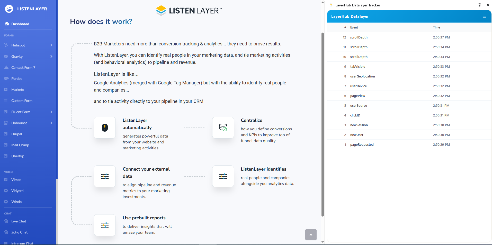

# LayerHub Datalayer Tracker


LayerHub is a professional Chrome extension designed for developers and analytics engineers to track, inspect, and debug `window.dataLayer` events in real-time. It provides a powerful, modular interface directly within the browser tab to streamline the validation of Tag Management and Analytics implementations.

## 🚀 Key Features

- **Real-time Tracking**: Instantly captures all events pushed to `window.dataLayer`.
- **Modular UI**: A clean, tabbed interface to view event details, debugging information, and system settings.
- **Side Panel & Floating Panel**: Support for both the Chrome Side Panel API and a floating in-page panel.
- **Advanced Data Inspection**:
  - Syntax-highlighted JSON view.
  - Event filtering and search.
  - Automatic sanitization of complex objects (circular references, functions, etc.).
- **Developer-Friendly**: Built with a modular architecture for easy maintenance and extension.

## 🏗️ Architecture

LayerHub uses a robust three-tier architecture to ensure reliable data capture and UI performance:

1.  **Background Script (`background.js`)**: Manages the extension lifecycle, handles side panel integration, and orchestrates script injection.
2.  **Page Hook (`pagehook.js`)**: Injected directly into the main page context to proxy the `dataLayer.push` method, ensuring no events are missed.
3.  **Content Script (`content-modular.js`)**: Runs in an isolated environment, manages the UI (via Shadow DOM to avoid CSS conflicts), and communicates with the Page Hook via custom DOM events.

## 📂 Project Structure

```text
layerhub/
├── assets/             # Project assets and documentation media
├── icons/              # Extension icons (16x16, 48x48, 128x128)
├── img/                # UI images and screenshots
├── plans/              # Feature plans and historical documentation
├── src/                # Modular source code
│   ├── account.js      # Account and subscription management
│   ├── render.js       # UI rendering logic for tabs and details
│   ├── settings.js     # Extension settings and configuration
│   ├── ui-components.js# Reusable UI component builders
│   └── utils.js        # Helper functions (formatting, date, etc.)
├── background.js       # Extension service worker
├── content-modular.js  # Main content script (modular entry point)
├── manifest.json       # Chrome Extension Manifest V3
├── pagehook.js         # MAIN world script for dataLayer interception
├── side_panel.html/js  # Chrome Side Panel implementation
├── styles.css          # Core UI styling
└── CLAUDE.md           # Developer guidance and project overview
```

## 🛠️ Installation

1.  Clone or download this repository to your local machine.
2.  Open Google Chrome and navigate to `chrome://extensions/`.
3.  Enable **Developer mode** (toggle in the top right corner).
4.  Click **Load unpacked** and select the root directory of this project.

## 📖 Usage

1.  Once installed, click the **LayerHub** icon in your browser's toolbar.
2.  Navigate to any website with a `dataLayer` implementation (e.g., sites using Google Tag Manager).
3.  The LayerHub panel will appear, listing events as they occur.
4.  **Click an event** to see its full JSON payload and metadata.
5.  Use the **tabs** to switch between Detailed View, Debug Info, and Settings.

## 💻 Development

The project is built with **Vanilla JavaScript** and **ES6 Modules**. It avoids heavy frameworks to maintain a small footprint and high performance.

- **Modularization**: All major logic is encapsulated within the `src/` directory.
- **Styling**: Styles are isolated using Shadow DOM in the content script to prevent the host website's CSS from breaking the LayerHub UI.
- **Testing**: Manual testing pages are provided in the root directory (e.g., `test-page.html`).

---

*Developed for LayerHub Lab.*
